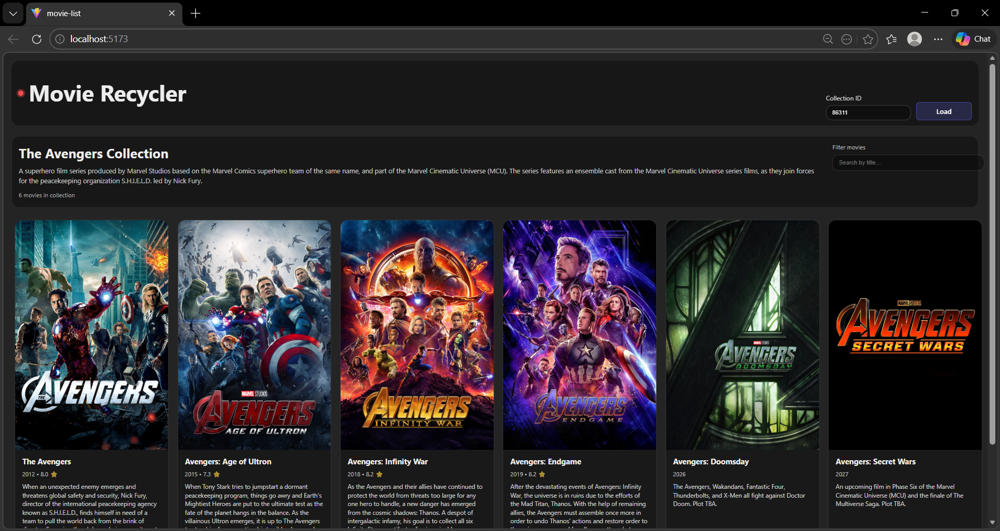

# Movie_List_Project
# Movie List App (React + Vite)

A small React application built with Vite that fetches and displays movie collection details from The Movie Database (TMDb) API.

The app uses the **TMDb Collection Details** endpoint to show a list of movies in a collection in a clean, card-based UI.

## 🚀 Features

- Fetches collection details (including movies) from the TMDb API
- Displays movie posters, titles, release years, and overviews
- Responsive grid layout with a modern look and feel
- Built with React (functional components + hooks)

## 🧩 TMDb API

This project uses the TMDb Collections API (https://developers.themoviedb.org/3/collections/get-collection-details).

### Recommended: use an environment variable
Create a `.env` file in the project root with:

```env
VITE_TMDB_API_KEY=your_api_key
```

The code reads it via `import.meta.env.VITE_TMDB_API_KEY`.

## 🧪 Run the project

```bash
npm install
npm run dev
```

Then open the URL shown in the terminal (usually `http://localhost:5173`).

## 📦 Build for production

```bash
npm run build
```

## 🛠️ Project Structure

- `src/main.jsx` – app entry point
- `src/App.jsx` – main component that coordinates data fetching
- `src/components/` – UI components (movie grid, movie cards, etc.)

## Project Output



## ✅ Notes

- The project is intentionally kept minimal but structured for easy extension.
- To change the collection, update the `collection_id` used in the API request.
